# 🚲 FullStack Data Engineering Project: Indego Bike Data  

## 📌 Project Overview  
The **Indego Bike Project** is a full-stack data engineering pipeline designed to collect, process, store, and visualize real-time bike share data from the **Indego API**. The project demonstrates modern data engineering practices, including cloud-based storage, ETL pipelines, modular transformations with dbt, and interactive dashboards for analytics.  

---

## ⚒️ Tools & Technologies  

- 🌐 **Indego API** → Source of real-time bike availability and station status  https://api.citybik.es/v2/networks/indego
- 🐍 **Python** → Data extraction & initial transformation scripts  
- ☁️ **Google Cloud (GCP)** → Infrastructure for storage and processing  
- 🛠️ **dbt** → Transformations and data modeling  
- 🗄️ **BigQuery** → Data warehouse for scalable storage & querying  
- 📊 **Apache Superset** → Business Intelligence (BI) dashboarding tool  

---

## 📂 Project Architecture  

```mermaid
flowchart LR
    A[🌐 Indego API] --> B[🐍 Python Script]
    B --> C[☁️ Google Cloud Storage]
    C --> D[🛠️ dbt Transformations]
    D --> E[🗄️ BigQuery]
    E --> F[📊 Apache Superset Dashboard]
```

## 📂 Current Dashboard

